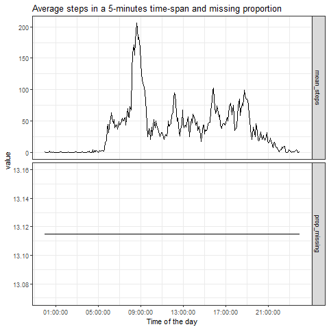

```{r settings}
  knitr::opts_chunk$set(message = FALSE, warning = FALSE)
```


# Introduction

This report uses data obtained from an anonymous subject whose daily activity
has been tracked in Otober and November, 2012. The dataset includes the steps
taken by this subject in 5 minutes time-spans.

We are interested in analyzing the total steps taken by the subject, visualizing
if there was any activity pattern in those months, and looking for differences
on activity between week-days and weekend-days.

# Software

```{r packages, echo = FALSE}
  paquetes <- c("dplyr", "tidyr", "ggplot2", "lubridate", "here")
  for (i in paquetes) {
    if (!require(i, character.only = TRUE)) {install.packages(i)}
    library(i, character.only = TRUE)
  }
  rm(list = c("paquetes", "i"))
```

We used the statistical program `r R.version.string` [@r]. We used the following
packages loaded in `R`:

+ `knitr` [@knitr1; @knitr2; @knitr3].
+ `dplyr` [@dplyr].
+ `tidyr` [@tidyr].
+ `ggplot2` [@ggplot2].
+ `lubridate` [@lubridate].
+ `here` [@here].

# Data

We used the walking dataset included with the [Reproducible Research Course][1],
available [here][2]. In the cleaning phase, we noted that each reported day has
288 observations, which correponds exactly with the `r 60*24/5` five minutes
time-spans in a given day, so we transformed the interval identificator in a
sequence in each day, we generated a variable called `time` which identifies the
beggining time of each interval, and we unified the information available in the
variables `date`and `time` in a variable called `daytime`, reflecting the
initial time of each time-span.

```{r data}
  # Unziping the dataset
  if (!dir.exists(here(".", "data"))) {dir.create(here(".", "data"))}
  unzip(here(".", "activity.zip"), exdir = here(".", "data"))
  
  # Loading and tidying the dataset
  walking <- read.csv(here(".", "data", "activity.csv")) %>%
    tbl_df %>%
    group_by(date) %>%
    mutate(interval = row_number(interval) - 1) %>%
    ungroup() %>%
    mutate(date = ymd(date),
           time = seconds_to_period(interval * 60 * 5),
           daytime = ymd_hms(date + time)) %>%
    group_by(date)
```


# Analysis

## What is the mean total number of steps taken per day?

```{r mean_steps}
  total_steps <- walking %>%
    summarize(total = sum(steps, na.rm = TRUE))
```

In the following plot is depicted the number of days in which the individual
walked each number of steps. It's interesting to note that the mean value
(vertical black line) is in a bin just observed in one day, and corresponds to
`r round(mean(total_steps$total, na.rm = TRUE), 2)` steps. Each day, this
subject walked between `r range(total_steps$total, na.rm = TRUE)[1]` and 
`r range(total_steps$total, na.rm = TRUE)[2]` steps.

```{r mean_steps_histo}
  # Create figure/ directory
  if (!dir.exists(here(".", "figure"))) {dir.create(here(".", "figure"))}

  # Export the graph
  png(here(".", "figure", "mean_steps_histo.png"))
  ggplot(total_steps, aes(total)) + 
    geom_histogram() + 
    geom_vline(aes(xintercept = mean(total, na.rm = TRUE))) +
    labs(title = "Total number of steps taken per day",
         x = "Number of steps", y = "Number of days") + 
    theme_bw()
  dev.off()
```


## What is the average daily activity pattern?

```{r statistics}
  statistics <- total_steps %>% 
    group_by(date) %>%
    summarize(mean = mean(total, na.rm = TRUE),
              median = median(total, na.rm = TRUE))
```

We take into account different summary statistics on the total daily walking
steps, shown in the next table. We noted that the *median* and the *mean* steps
were the same in each day of the months observed.^[However, when taking the 
analyzing the *mean* and *median* *between* days, as opossed to *within* days,
we obtained different values.]

```{r mean_median}
  print(paste("The mean and the median differed in", 
              sum(with(statistics, mean != median)), "days."))
  summary(total_steps$total) %>% 
    unclass %>% as.data.frame %>% 
    tibble::rownames_to_column() %>% 
    knitr::kable(col.names = c("Statistic", "Value"),
                 caption = "Summary statistics.")
```

In the following graph we ploted the daily mean of total steps during the
period.

```{r mean_steps_line}
  # Export graph
  png(here(".", "figure", "mean_steps_line.png"))
  ggplot(statistics, aes(x = date, y = mean)) +
    geom_line() +
    labs(title = "Mean steps taken each day",
         x = "Date", y = "Mean steps",
         caption = "Note: Mean and median steps taken each day are the same.") +
    theme_bw()
  dev.off()
```


In the following graph we observe the average number of steps taken in each
5-minute time-span by the subject. Here, we can observe that, on average, from
00:00 to 05:00 this individual do not use to walk, and that the most intensive
walking activity take place aproximately at 08:00.

```{r max_steps_line}
  # Compute maximum steps
  max_steps <- walking %>%
    ungroup() %>%
    group_by(interval) %>% 
    summarize(mean = mean(steps, na.rm = TRUE)) %>%
    mutate(time = seconds_to_period(interval * 5 * 60))
  # Export graph
  png(here(".", "figure", "max_steps_line.png"))
  ggplot(max_steps, aes(x = time, y = mean)) + 
    geom_line() + 
    theme_bw() +
    scale_x_time(breaks = seconds_to_period(seq(1, 24, by = 4) * 60^2)) + 
    labs(title = "Average steps in a 5-minutes time-span",
         x = "Time of the day", y = "Average steps")
  dev.off()
```


As a matter of fact, the most active 5-minute time-span, on average, is
the one shown in the followig table.

```{r max_steps_table}
  max_steps[which.max(max_steps$mean), 2:3] %>%
    knitr::kable(col.names = c("Steps", "Time"),
                 caption = "Maximum average number of steps.")
```


## Imputing missing values

In the following plot, we observed that the missing values are not related with
the time of meassurement, since the missing values represent 
`r round(mean(is.na(walking$steps)), 2)*100`%, regardless of the time or the
level of activity.

```{r missing_line}
  # Compute missings
  missing <- walking %>%
    ungroup() %>%
    group_by(interval) %>% 
    summarize(mean_steps = mean(steps, na.rm = TRUE),
              prop_missing = mean(is.na(steps)) * 100) %>%
    gather(key = "measure", value = "value", mean_steps, prop_missing) %>%
    mutate(time = seconds_to_period(interval * 5 * 60))
  # Export graph
  png(here(".", "figure", "missing_line.png"))
  ggplot(missing, aes(x = time, y = value)) + 
    geom_line() + 
    facet_grid(measure ~ ., scales = "free") +
    theme_bw() +
    scale_x_time(breaks = seconds_to_period(seq(1, 24, by = 4) * 60^2)) + 
    labs(title = "Average steps in a 5-minutes time-span and missing proportion",
         x = "Time of the day")
  dev.off()
```



We continued analyzing why the proportion of missing values were the same
across all time-spans in the period, and noted that all missing values were in
specific days, and that all the registries of these days were missing. This
information is shown in the following table. Note that there was 
`r nrow(walking %>% filter(is.na(steps)))` missing values in the database.

```{r missing_days}
  walking %>% filter(is.na(steps)) %>% select(date) %>% table %>% tbl_df %>%
    knitr::kable(col.names = c("Date", "Missing values"), 
                 caption = "Missing values, by date")
```

Therefore, our imputing strategy is replacing the missing values with the
time-span average.

```{r missing_strategy}
  replace <- walking %>%
    ungroup %>%
    group_by(interval) %>%
    summarize(steps2 = mean(steps, na.rm = TRUE))
  walking2 <- merge(walking, replace) %>%
    tbl_df %>%
    mutate(steps = ifelse(is.na(steps), steps2, steps)) %>% 
    select(-steps2) %>%
    arrange(daytime)
```

Bellow, is shown a histogram with the steps after imputing missing values.

```{r mean_steps_histo2}
  # Compute total_steps
  total_steps2 <- walking2 %>%
    group_by(date) %>%
    summarize(total = sum(steps))
  # Export graph
  png(here(".", "figure", "mean_steps_histo2.png"))
  ggplot(total_steps2, aes(total)) + 
    geom_histogram() + 
    geom_vline(aes(xintercept = mean(total, na.rm = TRUE))) +
    labs(title = "Total number of steps taken per day",
         x = "Number of steps", y = "Number of days",
         caption = "Note: Missing values imputed as time-spans averages") + 
    theme_bw()
  dev.off()
```


  
Note that the strategy of imputting average time-span values to replace missing
values does not imply major changes neither in the histogram shown previously,
nor in the discriptive statistics, shown bellow. The imputting strategy changed
mainly the minimum and first quartile, moderately the mean and median, and did 
not changed neither the third quartile nor the maximum value.


```{r mean_median2}
  rbind(summary(total_steps2$total), summary(total_steps$total)) %>%
    tbl_df %>% 
    mutate(Database = row_number(),
           Database = ifelse(Database == 1, "Imputed", "Original")) %>%
    select(7, 1:6) %>% 
    knitr::kable(caption = "Comparisson of summary statistics.")
```
  
## Are there differences in activity patterns between weekdays and weekends?

In the following plot we noted that, on average, weekday and weekend walking
intensity is different. We observed that the range of steps is lower in weekends
than in weekdays, but the weekend activity has more spikes than the weekday one.
One different approach for imputing data, would have been imputing by average 
time-spans, controlling for differences in the days of the week.

```{r weekdays}
  # Set locale to a common language
  Sys.setlocale(locale = "English")

  # Identifying weekdays and weekends
  weekly <- walking2 %>%
    mutate(weekdays = weekdays(date),
           weekdays = ifelse(weekdays %in% c("Saturday", "Sunday"),
                             "Weekend", "Weekday")) %>% 
    group_by(weekdays, interval) %>%
    summarize(mean = mean(steps)) %>% 
    ungroup %>%
    mutate(time = seconds_to_period(interval * 60 * 5))
  
  # Export graph
  png(here(".", "figure", "weekdays.png"))
  ggplot(weekly, aes(x = time, y = mean)) + 
    geom_line() + 
    facet_grid(. ~ weekdays) +
    theme_bw() +
    scale_x_time(breaks = seconds_to_period(seq(1, 24, by = 8) * 60^2)) + 
    labs(title = "Average steps in a 5-minutes time-span, by weekends and others",
         x = "Time of the day")
  dev.off()
```


## References

[1]: https://www.coursera.org/learn/reproducible-research?
[2]: https://d396qusza40orc.cloudfront.net/repdata%2Fdata%2Factivity.zip