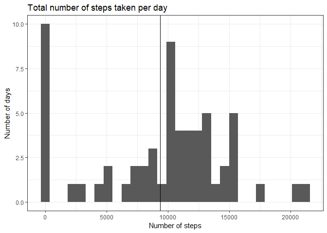
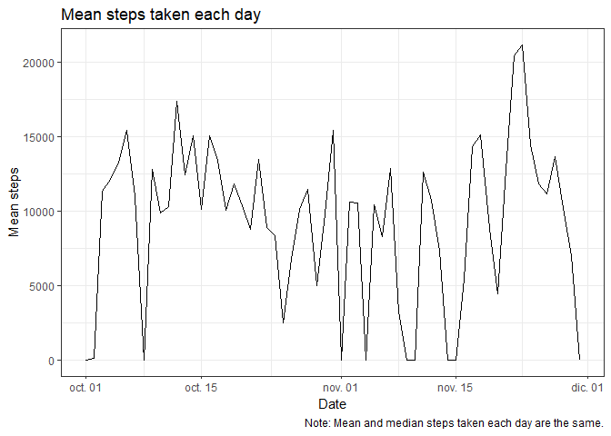

# Introduction

This report uses data obtained from an anonymous individual whose daily activity
has been tracked in Otober and November, 2017. The dataset includes the steps
performed by this individual in 5 minutes time-spans.

We are interested in analysing the total steps performed by the individual, 
visualizing if there was any activity pattern in those months, and looking for
differences on activity between week-days and weekend-days.

# Software


We used the statistical program R version 3.5.2 (2018-12-20) [@r]. We used the following
packages loaded in `R`:

+ `knitr` [@knitr1; @knitr2; @knitr3].
+ `dplyr` [@dplyr].
+ `tidyr` [@tidyr].
+ `ggplot2` [@ggplot2].
+ `lubridate` [@lubridate].
+ `here` [@here].

# Data

We used the walking dataset included with the [Reproducible Resear Course][1],
available [here][2]. In the cleaning phase we noted that each reported date has
288 observations, which correponds exactly with the 288 five minutes
time-spans in a given day, so we transformed the interval identificator in 
minutes of the day; and we generated a variable called `time` which unified the
information available in the variables `date`and `interval`, reflecting the 
initial time of each time-span.


```r
  # Unziping the dataset
  if (!dir.exists(here(".", "data"))) {dir.create(here(".", "data"))}
  unzip(here(".", "activity.zip"), exdir = here(".", "data"))
  
  # Loading and tidying the dataset
  walking <- read.csv(here(".", "data", "activity.csv")) %>%
    tbl_df %>%
    mutate(date = ymd(date),
           interval = row_number(interval) - 1,
           time = ymd_hms(as.character(
             date + seconds_to_period(interval * 5 * 60)))) %>%
    group_by(date)
```


# Analysis

## What is mean total number of steps taken per day?


```r
  mean_steps <- walking %>%
    summarize(total = sum(steps, na.rm = TRUE))
```

In the following plot is depicted the number of days in which the individual
walked each number of steps. It's intersting to note that the mean value 
(vertical black line) is in a bin just observed in one day, and corresponds to
9354.2295082. Each day, this individual walked
between 0 and 
21194 steps.


```r
  ggplot(mean_steps, aes(total)) + 
    geom_histogram() + 
    geom_vline(aes(xintercept = mean(total, na.rm = TRUE))) +
    labs(title = "Total number of steps taken per day",
         x = "Number of steps", y = "Number of days") + 
    theme_bw()
```

<!-- -->

## What is the average daily activity pattern?


```r
  statistics <- mean_steps %>% 
    group_by(date) %>%
    summarize(mean = mean(total, na.rm = TRUE),
              median = median(total, na.rm = TRUE))
```


We noted that mean and median daily activity gives the same numer in every
observed date. So, in the following graph we ploted the daily mean of total
steps during the period.


```r
  ggplot(statistics, aes(x = date, y = mean)) +
    geom_line() +
    labs(title = "Mean steps taken each day",
         x = "Date", y = "Mean steps",
         caption = "Note: Mean and median steps taken each day are the same.") +
    theme_bw()
```

<!-- -->


## Imputing missing values


## Are there differences in activity patterns between weekdays and weekends?

## References

[1]: https://www.coursera.org/learn/reproducible-research?
[2]: https://d396qusza40orc.cloudfront.net/repdata%2Fdata%2Factivity.zip
